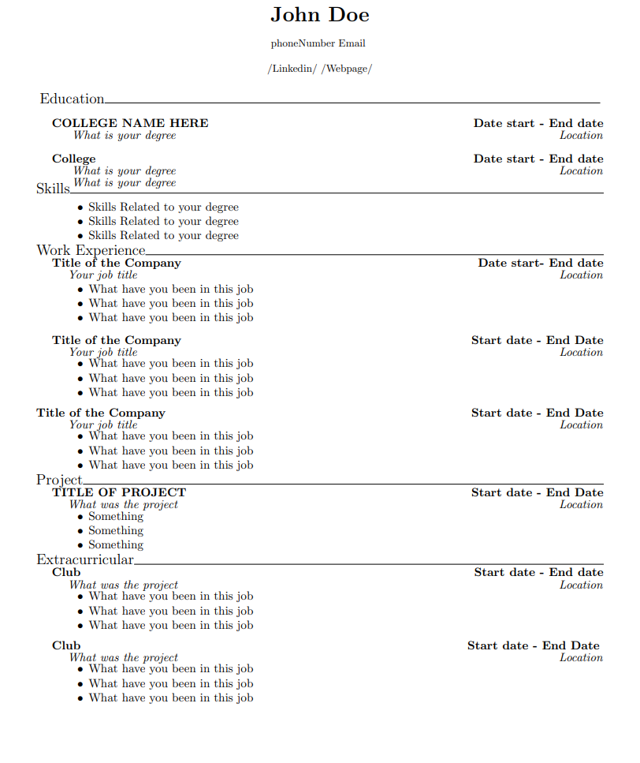
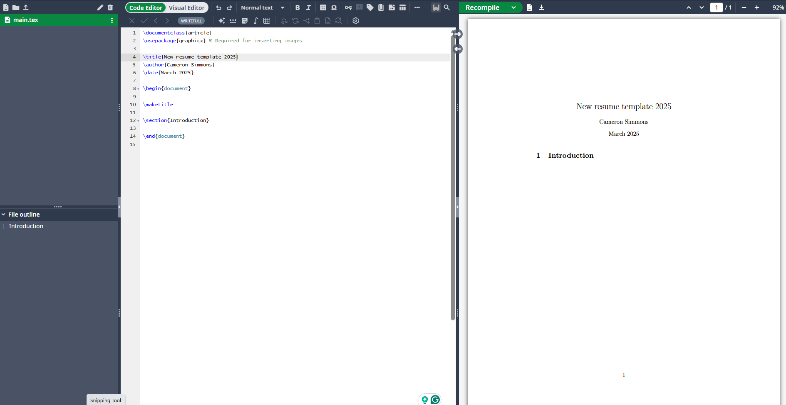

# Resume-Template
LaTeX resume templete

## Summary

I wanted to create a resume template for myself and my friends. I encountered challenges when using Word to format the information and adjust the spacing to fit all the necessary details on a single page. To overcome these limitations, I decided to design a resume template using LaTeX, which allowed me to have full control over the layout and ensure a polished, professional appearance that would appeal to potential employers.
---
This is the final result for how the page will look, please note it should be only one page.



## Getting it setup
1. Create an account using (https://www.overleaf.com/project)[Overleaf]
2. Once inside Overleaf click on **New Project** and *Blank Project*
3. Give the blank project a title "New resume template 2025"
*Below is a picture of where you should be at*
<br>

<br>

4. Delete the LaTeX syntax to the left of the page from ```\documentclass{article}``` to the end of the file ```\end{document}```
5. Once everything is deleted paste the Latex markup language in the side we just deleted.

```LaTex
\documentclass{article}
\usepackage{layout}
\usepackage{anyfontsize}
\usepackage[absolute,overlay]{textpos}%%
\usepackage{geometry}
\newgeometry{left=0.5in,right=0.5in,top=0.1in,bottom=1in}
\begin{document}
\begin{center}

%First and Last name
{\fontsize{.7cm}{.7cm}\selectfont \textbf{John Doe}}\break

%Phone # and email%
phoneNumber  Email \break

%Linkedin , Webpage if you have one, or location of where you live%
/Linkedin/ /Webpage/
\end{center}
\begin{center}

\end{center}
\vspace{10mm}


%Education%
\section*{}
\vspace{-30mm}%Changes spacing%
\textnormal{
    {\fontsize{5mm}{5mm}\selectfont Education}\hrulefill\textbf{}
}\break

%Fill out the college name%
\vspace{-.5mm}
\indent {\fontsize{4mm}{4mm}\selectfont \textbf{COLLEGE NAME HERE} \textit{} \textbf{\hfill Date start - End date}}

%Fill out the type of degree%
\indent\indent \fontsize{4mm}{4mm}\selectfont \textit{ What is your degree} \hfill {\hfill \textit{Location}}\break

%Adding a second college in case you are a transfer student%
%If you are not you can remove the format from "%%" to the next "%%"

%%
\indent {\fontsize{4mm}{4mm}\selectfont \textbf{College} \textit{} \textbf{\hfill Date start - End date}}

\indent\indent \fontsize{4mm}{4mm}\selectfont \textit{ What is your degree} \hfill{\hfill \textit{Location}}

\indent {\indent \fontsize{4mm}{4mm}\selectfont \textit{ What is your degree} \hfill}
%%

%Skills%
\section*{}
\vspace{-18mm}
\textnormal{{\fontsize{5mm}{5mm}\selectfont Skills}\hrulefill\textbf{}}\break
\vspace{.1mm} \break
\vspace{-10mm}%Spcaing for the bullet points and the section%

%Start of the bullet points%
%If you only have two bullet points remove the extra from "%%" to "%%"
\begin{itemize}

\vspace{.1mm}%spacing between the bullet points%
  %%
  {\setlength\itemindent{25pt} \item Skills Related to your degree}
  %%
  \vspace{-2mm}
  {\setlength\itemindent{25pt} \item Skills Related to your degree}

  %%
  \vspace{-2mm}
  {\setlength\itemindent{25pt} \item Skills Related to your degree}
  
  %%
\end{itemize}


\section*{}
\vspace{-15mm}
\textnormal{{\fontsize{5mm}{5mm}\selectfont Work Experience}\hrulefill\textbf{}}\break
\indent {\fontsize{4mm}{4mm}\selectfont \textbf{Title of the Company} %\textit{Anticipated Graduation May 2026}%
 \textbf{\hfill Date start- End date}}

 \indent\indent \fontsize{4mm}{4mm}\selectfont \textit{Your job title} \hfill {\hfill \textit{Location}}\break
 
 \vspace{-7mm}
\begin{itemize}

\vspace{.1mm}
  {\setlength\itemindent{25pt} \item What have you been in this job}

  
  \vspace{-2mm}
  {\setlength\itemindent{25pt} \item What have you been in this job}
  
  \vspace{-2mm}
  {\setlength\itemindent{25pt} \item What have you been in this job}

\end{itemize}
 
%Next job%
\indent {\fontsize{4mm}{4mm}\selectfont \textbf{Title of the Company} %\textit{Anticipated Graduation May 2026}%
 \textbf{\hfill Start date - End Date}}


 \indent\indent \fontsize{4mm}{4mm}\selectfont \textit{Your job title} \hfill {\hfill \textit{Location}}\break
%Next job%
 \vspace{-7mm}
\begin{itemize}

\vspace{.1mm}
  {\setlength\itemindent{25pt} \item What have you been in this job}
  
  \vspace{-2mm}
  {\setlength\itemindent{25pt} \item What have you been in this job}

  
  \vspace{-2mm}
  {\setlength\itemindent{25pt} \item What have you been in this job}
  
\end{itemize}
\indent {\fontsize{4mm}{4mm}\selectfont \textbf{Title of the Company} %\textit{Anticipated Graduation May 2026}%
 \textbf{\hfill {Start date - End Date}}

 \indent\indent \fontsize{4mm}{4mm}\selectfont \textit{Your job title} \hfill {\hfill \textit{Location}}\break
  \vspace{-7mm}
\begin{itemize}

\vspace{.1mm}
  {\setlength\itemindent{25pt} \item What have you been in this job}
  
  \vspace{-2mm}
  {\setlength\itemindent{25pt} \item What have you been in this job}
  
  \vspace{-2mm}
  {\setlength\itemindent{25pt} \item What have you been in this job}

\end{itemize}
%Next job%

\section*{}
\vspace{-15mm}
\textnormal{{\fontsize{5mm}{5mm}\selectfont Project}\hrulefill\textbf{}}\break
\indent {\fontsize{4mm}{4mm}\selectfont \textbf{TITLE OF PROJECT} %\textit{Anticipated Graduation May 2026}%
 \textbf{\hfill Start date - End Date}}

 \indent\indent \fontsize{4mm}{4mm}\selectfont \textit{What was the project} \hfill {\hfill \textit{Location}}\break
 \vspace{-7mm}
\begin{itemize}

\vspace{.1mm}
  {\setlength\itemindent{25pt} \item Something}
  
  \vspace{-2mm}
  {\setlength\itemindent{25pt} \item Something}
  
  \vspace{-2mm}
  {\setlength\itemindent{25pt} \item Something}

\end{itemize}

\section*{}
\vspace{-15mm}
\textnormal{{\fontsize{5mm}{5mm}\selectfont Extracurricular}\hrulefill\textbf{}}\break
\indent {\fontsize{4mm}{4mm}\selectfont \textbf{Club} %\textit{Anticipated Graduation May 2026}%
 \textbf{\hfill Start date - End date}}\break
 \indent\indent \fontsize{4mm}{4mm}\selectfont \textit{What was the project} \hfill {\hfill \textit{Location}}\break
	\vspace{-7mm}
\begin{itemize}

\vspace{.1mm}
  {\setlength\itemindent{25pt} \item What have you been in this job}
  
  \vspace{-2mm}
  {\setlength\itemindent{25pt} \item What have you been in this job}

  
  \vspace{-2mm}
  {\setlength\itemindent{25pt} \item What have you been in this job}
  
\end{itemize}

\indent {\fontsize{4mm}{4mm}\selectfont \textbf{Club} %\textit{Anticipated Graduation May 2026}%
 \textbf{\hfill Start date - End Date}} \break
 \indent\indent \fontsize{4mm}{4mm}\selectfont \textit{What was the project} \hfill {\hfill \textit{Location}}\break
 \vspace{-7mm}
\begin{itemize}

\vspace{.1mm}
  {\setlength\itemindent{25pt} \item What have you been in this job}
  
  \vspace{-2mm}
  {\setlength\itemindent{25pt} \item What have you been in this job}

  
  \vspace{-2mm}
  {\setlength\itemindent{25pt} \item What have you been in this job}
  
\end{itemize}

\end{document}


```
